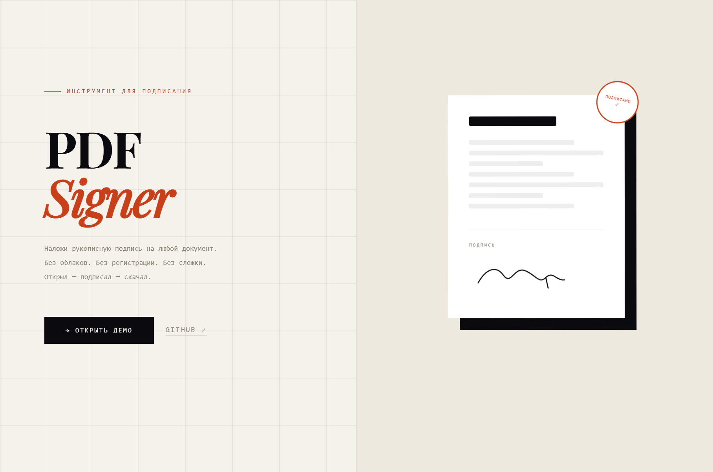
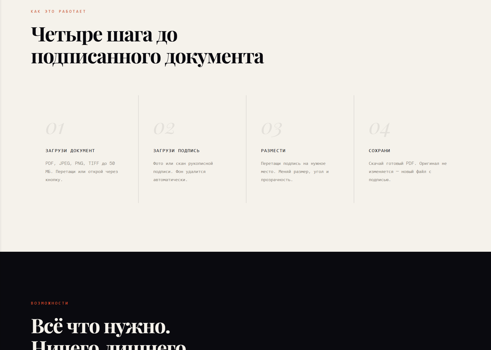
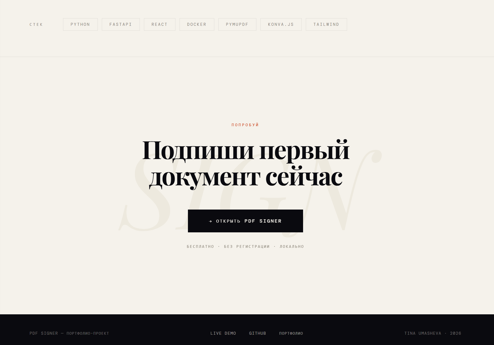
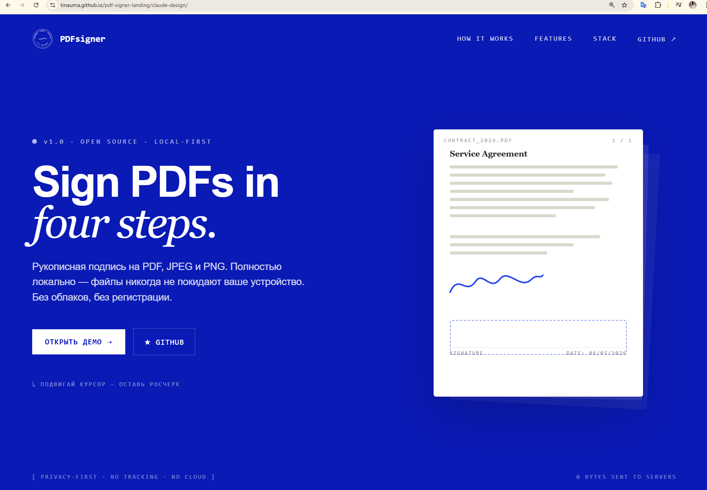
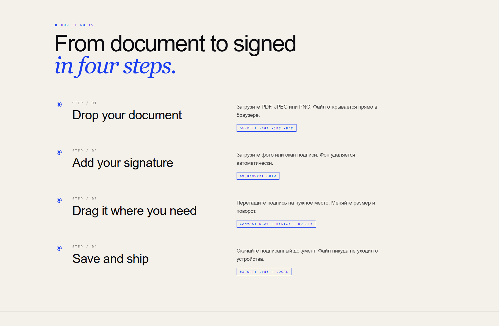
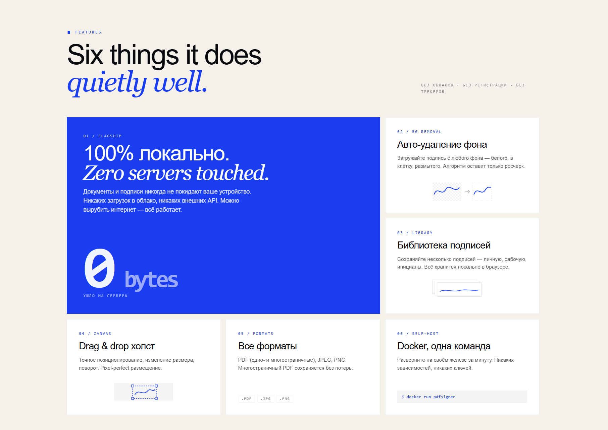
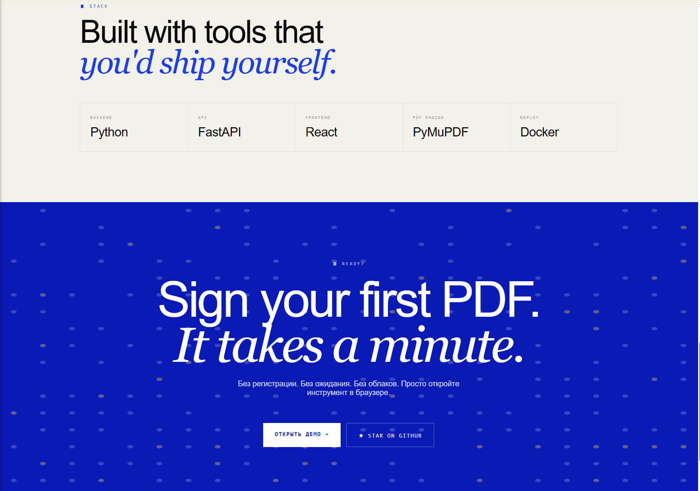

[English](README.md) | **Русский**

# PDFsigner — Лендинг

Лендинг для [PDFsigner](https://github.com/TinaUma/PDF_Signer) — инструмента для подписи PDF прямо на устройстве.  
Сделан **двумя способами**, чтобы сравнить подходы по скорости, контролю и качеству результата.

---

## Живое демо

| Версия | Ссылка |
|---|---|
| Витрина (эта страница) | https://tinauma.github.io/pdf-signer-landing/ |
| Ручной HTML/CSS | https://tinauma.github.io/pdf-signer-landing/claude-html/ |
| Claude Design | https://tinauma.github.io/pdf-signer-landing/claude-design/ |

---

## Два подхода

### Подход A — Ручной HTML/CSS [`/claude-html`](claude-html/)

Написан с нуля, без фреймворков:
- Семантическая разметка HTML5
- Кастомный CSS (flexbox/grid, анимации, переменные)
- Vanilla JS для интерактивных элементов
- Полный контроль над структурой, именованием и производительностью

### Подход B — Claude Design [`/claude-design`](claude-design/)

Собран визуально в [Claude Design](https://claude.ai/design):
- AI-помощь с макетом и стилями
- Быстрые итерации через интерфейс дизайн-инструмента
- Экспорт в самодостаточный standalone HTML-бандл

---

## Сравнение

| | Ручной код | Claude Design |
|---|---|---|
| Скорость | Медленнее — каждая деталь вручную | Быстро — макет за минуты |
| Контроль | Полный | Частичный — экспорт непрозрачен |
| Качество стиля | Хорошее, требует усилий | Полированное из коробки |
| Поддержка кода | Легко редактировать | Сложнее — бандл как чёрный ящик |
| Лучше всего для | Продакшн, портфолио | Прототипы, демо для клиентов |

**Вывод:** Claude Design выигрывает по скорости на начальных макетах; ручной код — по гибкости и долгосрочной поддержке.

---

## О PDFsigner

PDFsigner — локальный инструмент для подписи PDF, JPEG и PNG рукописной подписью.  
Файлы никогда не покидают устройство. Без облака, без регистрации.

→ [Репозиторий PDFsigner](https://github.com/TinaUma/PDF_Signer)

---

## Технологии

`HTML` `CSS` `Vanilla JS` `Claude Design` `GitHub Pages`
